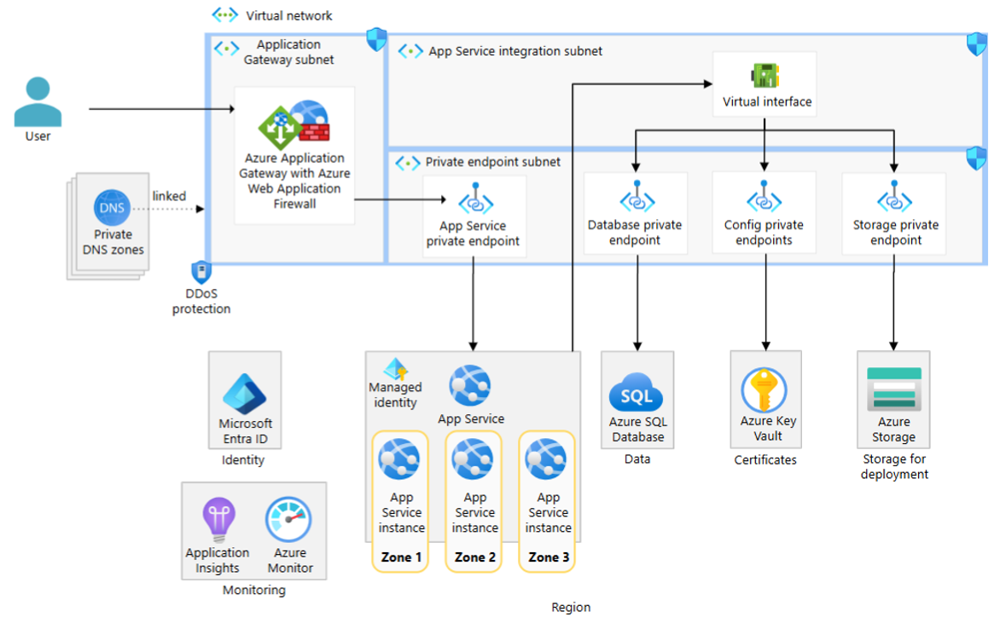

# Azure Web アプリケーション リファレンスアーキテクチャ (IaC)

Azure 上でセキュアかつ可用性の高い Web アプリケーションを構築するためのリファレンスアーキテクチャを、Bicep でデプロイするための Infrastructure as Code (IaC) プロジェクトです。

すべての受信・送信通信を仮想ネットワーク (VNet) 内のプライベートエンドポイント経由に閉じ込め、App Service のマネージド ID を用いたパスワードレスなリソースアクセスを実現します。

---

## 目次

- [概要](#概要)
- [アーキテクチャ](#アーキテクチャ)
- [デプロイされるリソース](#デプロイされるリソース)
- [フィーチャーフラグ (オプションリソースの選択)](#フィーチャーフラグ-オプションリソースの選択)
- [利用条件 (前提と必要な Azure ロール)](#利用条件-前提と必要な-azure-ロール)
- [利用手順](#利用手順)
  - [1. リポジトリの取得](#1-リポジトリの取得)
  - [2. パラメーターファイルの編集](#2-パラメーターファイルの編集)
  - [3. デプロイ前のクォータ確認 (推奨)](#3-デプロイ前のクォータ確認-推奨)
  - [4. リソースグループの作成](#4-リソースグループの作成)
  - [5. デプロイの実行](#5-デプロイの実行)
  - [6. デプロイ結果の確認](#6-デプロイ結果の確認)
- [デプロイしたリソースに応じた個別手順](#デプロイしたリソースに応じた個別手順)
  - [Application Gateway をデプロイした場合: カスタムドメイン / HTTPS の設定](#application-gateway-をデプロイした場合-カスタムドメイン--https-の設定)
  - [PostgreSQL をデプロイした場合](#postgresql-をデプロイした場合)
  - [Blob Storage をデプロイした場合](#blob-storage-をデプロイした場合)
  - [Application Insights をデプロイした場合](#application-insights-をデプロイした場合)
- [アプリケーションのデプロイ](#アプリケーションのデプロイ)
- [リソースの削除](#リソースの削除)
- [ディレクトリ構成](#ディレクトリ構成)

---

## 概要

### 目的

- Azure の App Service を中心とした Web アプリケーション向けの、**本番相当のセキュアなネットワーク構成**をワンステップでデプロイできるようにします。
- すべての PaaS リソースへの通信を **プライベートエンドポイント経由**に限定し、パブリックアクセスを無効化します。
- App Service の **システム割り当てマネージド ID** に必要最小限のロールを付与し、シークレットレス / パスワードレスなリソースアクセスを実現します。
- 利用者の要件に応じて、Application Gateway・PostgreSQL・Blob Storage・Application Insights を**個別にデプロイの有無を選択**できます。デプロイしないリソースについては、対応するプライベートエンドポイントや Private DNS Zone も自動的にデプロイされません。

### 特徴

- **可用性ゾーン対応**: App Service プラン (Premium v3) をゾーン冗長構成 (3 インスタンス) でデプロイします。
- **疎結合**: 本 IaC プロジェクトは特定のアプリケーションに依存しません。実際のアプリケーション (サンプル: Flask アプリ) のデプロイ手順は [docs/app-deployment.md](docs/app-deployment.md) に分離しています。
- **CI/CD 非依存**: Azure CLI もしくは Azure Portal からの手動デプロイを前提としています。

---

## アーキテクチャ

本 IaC は、以下のリファレンスアーキテクチャ (App Service のマルチリージョン / ゾーン冗長 Web アプリ) を実装しています。図では Azure SQL Database が使われていますが、本 IaC では **Azure Database for PostgreSQL Flexible Server** を使用します。



| アーキテクチャ図の要素 | 本 IaC での実装 |
| --- | --- |
| Azure SQL Database | **Azure Database for PostgreSQL Flexible Server** |
| Managed identity | App Service のシステム割り当てマネージド ID |
| Config private endpoints | Azure Key Vault のプライベートエンドポイント |
| Storage for deployment | Azure Blob Storage のプライベートエンドポイント |

---

## デプロイされるリソース

| リソース | 常時 / オプション | 備考 |
| --- | --- | --- |
| 仮想ネットワーク + サブネット 3 種 + NSG | 常時 | App Gateway / App Service 統合 / プライベートエンドポイント |
| App Service プラン (P1v3, ゾーン冗長) | 常時 | Linux / Python |
| App Service (Web App) | 常時 | システム割り当てマネージド ID、パブリックアクセス無効 |
| App Service 用プライベートエンドポイント + Private DNS Zone | 常時 | `privatelink.azurewebsites.net` |
| Application Gateway (WAF v2) + 公開 IP + WAF ポリシー | オプション | `deployApplicationGateway` |
| Azure Key Vault + PE + Private DNS Zone | オプション | Application Gateway とセットでデプロイ |
| Azure Database for PostgreSQL + PE + Private DNS Zone | オプション | `deployPostgreSql` |
| Azure Blob Storage + PE + Private DNS Zone | オプション | `deployStorage` |
| Application Insights + Log Analytics | オプション | `deployApplicationInsights` |
| DDoS 保護プラン | オプション | `deployDdosProtection` |

### 付与されるロール (App Service マネージド ID)

デプロイしたリソースに応じて、App Service のマネージド ID に以下のロールが自動で付与されます。

| 対象リソース | ロール | 用途 |
| --- | --- | --- |
| Azure Blob Storage | Storage Blob Data Reader | Blob からの PDF 読み取り |
| Application Insights | Monitoring Metrics Publisher | テレメトリ送信 |
| Azure Key Vault | Key Vault Secrets User | シークレット / 構成の読み取り |
| Azure Database for PostgreSQL | Microsoft Entra 管理者として登録 | パスワードレス接続 |

> Application Gateway のマネージド ID (ユーザー割り当て) にも、Key Vault から TLS 証明書を読み取るための **Key Vault Secrets User** ロールが自動付与されます。

---

## フィーチャーフラグ (オプションリソースの選択)

`infra/main.parameters.json` の以下のパラメーターで、デプロイするリソースを選択できます。`false` にすると、そのリソースだけでなく、対応するプライベートエンドポイントと Private DNS Zone も**デプロイされません**。

| パラメーター | 既定値 | 説明 |
| --- | --- | --- |
| `deployApplicationGateway` | `true` | Application Gateway (WAF)。Azure Key Vault もセットでデプロイ |
| `deployPostgreSql` | `true` | Azure Database for PostgreSQL |
| `deployStorage` | `true` | Azure Blob Storage |
| `deployApplicationInsights` | `true` | Application Insights + Log Analytics |
| `deployDdosProtection` | `false` | DDoS 保護プラン |

例: PostgreSQL が不要な場合は `deployPostgreSql` を `false` にすると、PostgreSQL 本体・PostgreSQL 用プライベートエンドポイント・`privatelink.postgres.database.azure.com` の Private DNS Zone がすべてデプロイ対象外になります。

### App Service の SKU / スケール設定

App Service プランの SKU やインスタンス数は、以下のパラメーターで変更できます。

| パラメーター | 既定値 | 説明 |
| --- | --- | --- |
| `appServiceSkuName` | `P1v3` | App Service プランの SKU。`B1`〜`B3` / `S1`〜`S3` / `P1v2`〜`P3v2` / `P0v3`〜`P3v3` / `P1mv3`〜`P3mv3` から選択 |
| `appServicePlanCapacity` | `3` | インスタンス数 (1〜30)。ゾーン冗長時は自動で 2 以上に調整されます |
| `appServiceZoneRedundant` | `true` | ゾーン冗長の希望値。SKU が非対応の場合は自動的に無効化されます |

> **ゾーン冗長の自動判定**: ゾーン冗長は Premium v2/v3 SKU (`Pxv2` / `Pxv3` / `Pxmv3`) のみでサポートされます。`appServiceZoneRedundant` を `true` にしていても、Basic (`Bx`) / Standard (`Sx`) などの非対応 SKU を選択した場合は、デプロイエラー (`SkuDoesNotSupportZoneRedundancy`) を避けるために **自動的にゾーン冗長が無効化**されます。ゾーン冗長を確実に有効化したい場合は Premium SKU を選択してください。

---

## 利用条件 (前提と必要な Azure ロール)

### 前提ツール

- [Azure CLI](https://learn.microsoft.com/cli/azure/install-azure-cli) (2.60 以降を推奨)
- Bicep CLI (Azure CLI に同梱。`az bicep install` で導入可能)
- [`jq`](https://jqlang.github.io/jq/) / `curl` (クォータ確認スクリプト `scripts/check-quota.sh` で使用)
- 有効な Azure サブスクリプション

### 必要な Azure ロール

デプロイを実行するプリンシパル (ユーザー) には、対象リソースグループ (またはサブスクリプション) に対して以下の権限が必要です。

| ロール | 必要な理由 |
| --- | --- |
| **Contributor** | 各種 Azure リソースの作成 |
| **User Access Administrator** または **Owner** | App Service マネージド ID / Application Gateway ID へのロール付与 (`Microsoft.Authorization/roleAssignments`) |

> Key Vault はパージ保護 (purge protection) が有効です。同名の Key Vault を再作成する場合は、論理削除された Key Vault のパージが必要になる点にご注意ください。

---

## 利用手順

### 1. リポジトリの取得

```bash
git clone <このリポジトリの URL>
cd web-app-ref-arch-iac
az login
az account set --subscription <SUBSCRIPTION_ID>
```

### 2. パラメーターファイルの編集

[infra/main.parameters.json](infra/main.parameters.json) を開き、要件に合わせて編集します。

- `workloadName`: リソース名のプレフィックス (英小文字・数字、2〜12 文字)
- `deployApplicationGateway` / `deployPostgreSql` / `deployStorage` / `deployApplicationInsights` / `deployDdosProtection`: デプロイの有無
- `appServiceSkuName` / `appServicePlanCapacity` / `appServiceZoneRedundant`: App Service プランの SKU・インスタンス数・ゾーン冗長 (詳細は [App Service の SKU / スケール設定](#app-service-の-sku--スケール設定) を参照)
- (任意) `deployAdditionalPostgresAdmin` を `true` にし、`additionalPostgresAdminObjectId` / `additionalPostgresAdminName` / `additionalPostgresAdminType` を設定すると、PostgreSQL に手動管理用の Entra 管理者 (人間やグループ) を追加できます。

### 3. デプロイ前のクォータ確認 (推奨)

デプロイ先のリージョンで **クォータ / SKU の空きがあり、デプロイ可能か** を事前確認します。App Service (Premium v3 など) や PostgreSQL はリージョン・SKU によっては提供がない・クォータ不足の場合があり、デプロイ本番で初めてエラーになることがあるためです。

> **補足**: `az deployment group what-if` はリソースの差分プレビューであり、クォータは確認しません。クォータの事前確認には本スクリプトを使用してください。

**前提**: `az login` 済みであること、および [`jq`](https://jqlang.github.io/jq/) / `curl` がインストール済みであること。

```bash
# 既定のリージョン一覧を確認 (全 Azure パブリックリージョン 41 拠点、main.parameters.json の設定を自動反映)
./scripts/check-quota.sh

# リージョンを指定して確認
./scripts/check-quota.sh -l japaneast,eastus2,westeurope

# 確認する App Service SKU を指定 (既定: B1,P0V3 に加え設定 SKU)
./scripts/check-quota.sh --skus B1,P0V3,P1V3

# 同時実行数 / タイムアウトを調整 (遅いネットワークでのチューニング)
./scripts/check-quota.sh --jobs 12 --timeout 20

# what-if による最終検証コマンド例も表示
./scripts/check-quota.sh --show-validate
```

> スクリプトはアクセストークンを 1 回だけ取得し、以降は `curl` で ARM REST を **並列**呼び出すため高速に完了します。

スクリプトは以下をリージョンごとに確認し、最後に `OK` / `NG` のサマリを表示します。

- **App Service**: SKU のリージョン提供状況 (Linux ワーカー)。既定で `B1` / `P0V3` と設定中の SKU を確認
- **PostgreSQL Flexible Server**: 設定中の SKU / ティアの提供状況
- **ストレージ**: リージョンあたりのアカウント数クォータ
- **ネットワーク**: 仮想ネットワーク / Public IP / Application Gateway の使用量とクォータ

> App Service の Premium v3 vCPU や PostgreSQL vCore は、SKU が提供されていても割り当てクォータが 0 / 不足の場合があります。その場合は Azure Portal の [クォータ] から引き上げを申請してください。

### 4. リソースグループの作成

```bash
az group create \
  --name <RESOURCE_GROUP> \
  --location <LOCATION>   # 例: japaneast
```

### 5. デプロイの実行

```bash
az deployment group create \
  --resource-group <RESOURCE_GROUP> \
  --template-file infra/main.bicep \
  --parameters infra/main.parameters.json
```

デプロイ前に構文・整合性を確認したい場合は、`what-if` を利用します。

```bash
az deployment group what-if \
  --resource-group <RESOURCE_GROUP> \
  --template-file infra/main.bicep \
  --parameters infra/main.parameters.json
```

### 6. デプロイ結果の確認

デプロイ完了後、出力値を確認します。以降の手順で使用します。

```bash
az deployment group show \
  --resource-group <RESOURCE_GROUP> \
  --name main \
  --query properties.outputs
```

主な出力値: `appServiceName`, `appServiceDefaultHostName`, `applicationGatewayPublicIp`, `postgresServerName`, `storageAccountName`, `keyVaultName` など。

---

## デプロイしたリソースに応じた個別手順

デプロイしたリソースによって追加の設定手順が異なります。デプロイしたものだけを実施してください。

### Application Gateway をデプロイした場合: カスタムドメイン / HTTPS の設定

本 IaC は、デプロイ時点では **HTTP (ポート 80) リスナー**のみを構成します (証明書が存在しない状態でもデプロイを成功させるため)。運用時には以下の手順で HTTPS リスナーとカスタムドメインを構成してください。Key Vault と Application Gateway 用マネージド ID、および必要なロール付与はデプロイ済みです。

1. **証明書を Key Vault に登録する**
   - 独自ドメインの PFX 証明書を Key Vault にインポートするか、App Service マネージド証明書 / 公的認証局から取得した証明書を Key Vault の証明書として登録します。
   - Key Vault はパブリックアクセスが無効です。ポータルやローカルから証明書を登録する際は、プライベートエンドポイント経由でアクセスするか、一時的に自分の IP を許可してください。

2. **Application Gateway に SSL 証明書を追加する**
   - Application Gateway → 設定 → **リッスンの設定 (SSL 証明書)** で、Key Vault のシークレット (証明書) を参照する SSL 証明書を追加します。
   - 証明書の読み取りには、デプロイ済みのユーザー割り当てマネージド ID (`id-agw-...`) が使用されます (Key Vault Secrets User 付与済み)。

3. **HTTPS リスナーとルーティング規則を追加する**
   - ポート 443 のフロントエンドポートと HTTPS リスナー (上記 SSL 証明書を使用) を追加します。
   - 既存のバックエンドプール (`appServiceBackendPool`) と HTTPS バックエンド設定 (`appServiceHttpsSettings`) に紐づくルーティング規則を作成します。
   - 必要に応じて HTTP → HTTPS のリダイレクト規則を追加します。

4. **カスタムドメインの DNS を設定する**
   - ドメインの DNS プロバイダーで、`applicationGatewayPublicIp` (出力値) を指す A レコード、または Application Gateway の FQDN を指す CNAME レコードを作成します。

5. **App Service 側のアクセス制限 (任意)**
   - App Service はプライベートエンドポイント経由でのみ受信可能です。Application Gateway からのアクセスは、同一 VNet 内の App Service プライベートエンドポイントに対して行われるため、追加設定は不要です。

### PostgreSQL をデプロイした場合

- App Service のマネージド ID は、デプロイ時に自動で **PostgreSQL の Entra 管理者**として登録されます。
- 認証は Microsoft Entra 認証のみ (パスワードレス) です。アプリケーションは `POSTGRES_HOST` / `POSTGRES_DB` / `POSTGRES_USER` の各アプリ設定 (デプロイ時に自動設定済み) を用いてトークン認証で接続します。
- 人間が手動で DB を操作する場合は、`deployAdditionalPostgresAdmin` を利用して自分自身を Entra 管理者として追加するか、デプロイ後に `az postgres flexible-server ad-admin create` で追加してください。

### Blob Storage をデプロイした場合

- App Service のマネージド ID には **Storage Blob Data Reader** ロールが付与済みです。
- アプリ設定 `AZURE_STORAGE_ACCOUNT_NAME` / `AZURE_STORAGE_CONTAINER_NAME` はデプロイ時に自動設定されます。
- 既定で `pdf` コンテナーが作成されます。PDF ファイルのアップロード手順は [docs/app-deployment.md](docs/app-deployment.md#blob-storage-pdf-表示) を参照してください。

### Application Insights をデプロイした場合

- App Service のマネージド ID には **Monitoring Metrics Publisher** ロールが付与済みです。
- アプリ設定 `APPLICATIONINSIGHTS_CONNECTION_STRING` はデプロイ時に自動設定されます。
- アプリケーション側の OpenTelemetry 自動計装コードにより、マネージド ID 認証でテレメトリが送信されます。

---

## アプリケーションのデプロイ

本 IaC プロジェクトはインフラのみを構築します。実際の Web アプリケーション (サンプル: Flask アプリ) を App Service にデプロイする手順は、別ドキュメントに記述しています。

➡ **[docs/app-deployment.md](docs/app-deployment.md)** を参照してください。

> **補足 (送信経路について)**: App Service は全送信トラフィックを VNet 経由 (`vnetRouteAllEnabled=true`) にしていますが、統合サブネットに送信インターネット経路 (NAT Gateway 等) は配置していません。そのため、デプロイ時の Oryx ビルド (`pip install`) が外部へ到達できず `504 GatewayTimeout` になることがあります。回避手順 (デプロイ中のみ `WEBSITE_VNET_ROUTE_ALL=0` にする) は [docs/app-deployment.md](docs/app-deployment.md#2-app-service-へのデプロイ) に記載しています。

---

## リソースの削除

```bash
az group delete --name <RESOURCE_GROUP> --yes --no-wait
```

> Key Vault はパージ保護が有効なため、削除後も論理削除状態で保持されます。完全に削除する場合は `az keyvault purge --name <KEY_VAULT_NAME>` を実行してください。

---

## ディレクトリ構成

```
web-app-ref-arch-iac/
├── README.md                       # 本ファイル (プロジェクト全体の説明)
├── docs/
│   └── app-deployment.md           # アプリケーションのデプロイ手順 (疎結合)
├── scripts/
│   └── check-quota.sh              # デプロイ前のクォータ / SKU 確認スクリプト
└── infra/
    ├── main.bicep                  # メインのオーケストレーション
    ├── main.parameters.json        # パラメーターファイル (デプロイの有無を選択)
    └── modules/
        ├── network.bicep           # VNet / サブネット / NSG / DDoS 関連付け
        ├── privateDnsZone.bicep    # Private DNS Zone + VNet リンク
        ├── privateEndpoint.bicep   # プライベートエンドポイント + DNS ゾーングループ
        ├── monitoring.bicep        # Log Analytics + Application Insights
        ├── keyVault.bicep          # Azure Key Vault
        ├── storage.bicep           # Azure Blob Storage
        ├── postgresql.bicep        # PostgreSQL Flexible Server (Entra 認証)
        ├── appService.bicep        # App Service プラン + Web App
        ├── applicationGateway.bicep# Application Gateway (WAF) + 公開 IP + ID
        └── roleAssignments.bicep   # App Service マネージド ID へのロール付与
```
